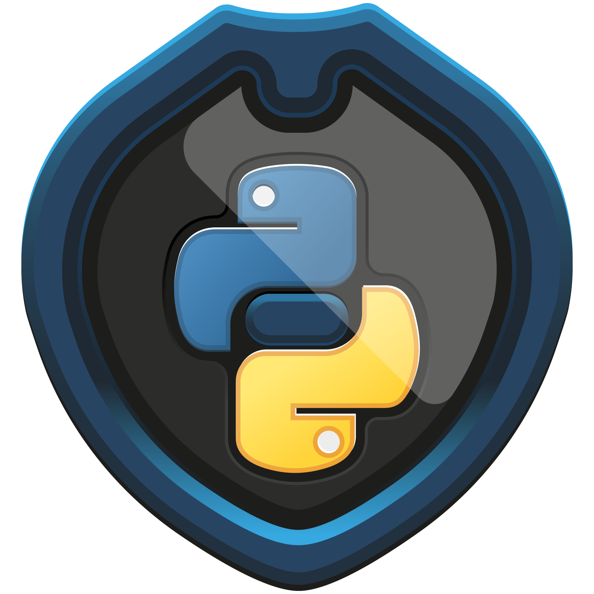

    
<h1>Introdução à programação com Python </h1>

> O curso trará todo o embasamento da linguagem Python, quando e onde é mais indicado aplicá-la.  possibilidades no uso de bancos NoSQL de forma distribuída. 
* Carga horária: 8 h
* Nível: Básico