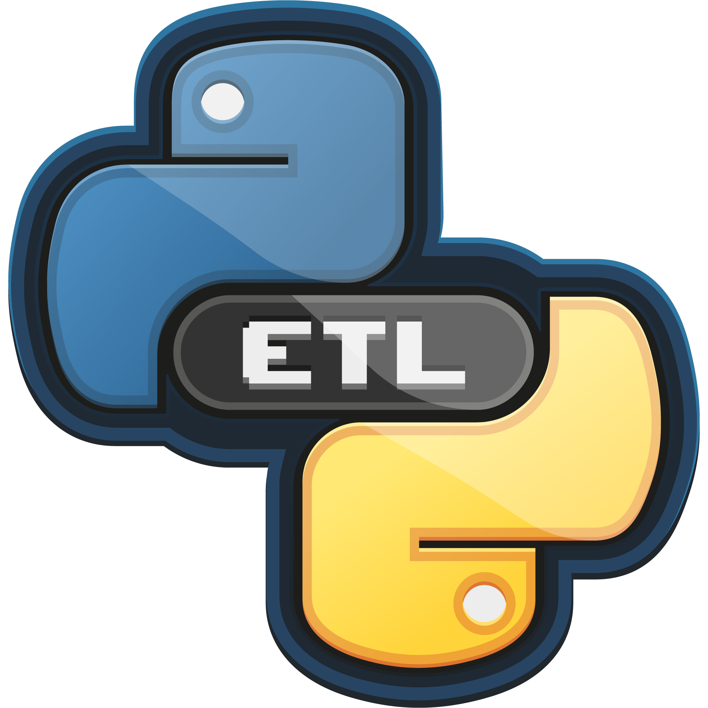

    
<h1>Fundamentos de ETL com Python  </h1>

> Aprenda sobre o processo de Extract Transform and Load (ETL) e como transformar seus dados e deixa-los prontos para seus projetos. 
* Carga horária: 5 h
* Nível: Intermediário