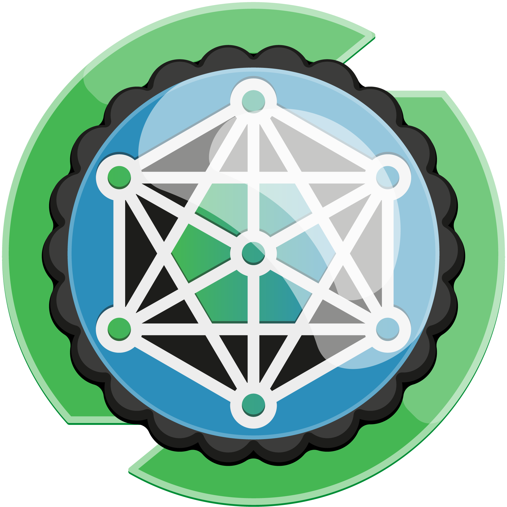

    
<h1>Orquestrando ambientes de Big Data distribuídos com Zookeeper, Yarn e Sqoop </h1>

> Explore algumas das principais ferramentas relacionadas à plataforma Hadoop. Nesse contexto, aprenda mais sobre Zookeeper para gerenciar sistemas distribuídos e Sqoop para transferir informações entre bancos de dados relacionais. Além disso, conheça o YARN (Yet Another Resource Negotiator), um elemento central da arquitetura do Hadoop para o gerenciamento de recursos. 
* Carga horária: 4 h
* Nível: Intermediário