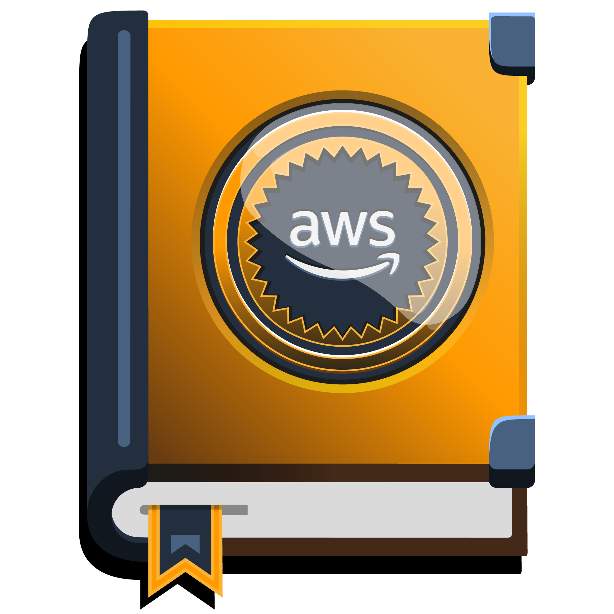

    
<h1>Introdução a Engenharia de Dados na AWS </h1>

> Conheça algumas das principais ferramentas para Engenharia de Dados disponíveis na Amazon Web Services (AWS). Nesse contexto, o expert explora os conceitos de ingestão, transformação e análise de dados em uma abordagem totalmente prática. 
* Carga horária: 2 h
* Nível: Intermediário