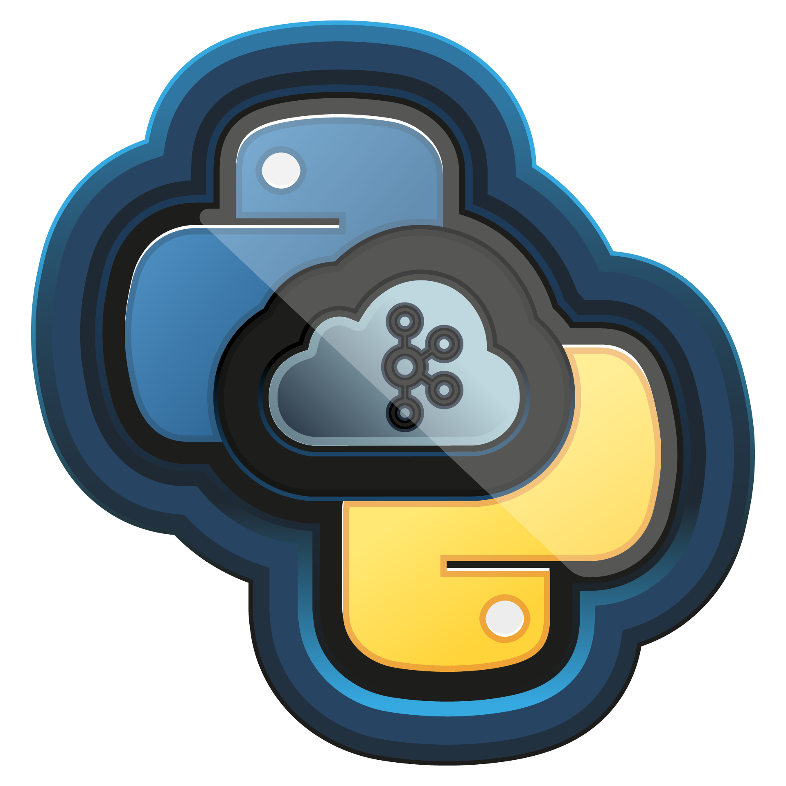

    
<h1>Introdução à Mensageria na Nuvem Com Kafka e Python </h1>

> Aprenda um pouco sobre uma das arquiteturas mais utilizadas atualmente, a orientada a eventos. Para isso, explore o Kafka na nuvem usando o CloudKarafka e a linguagem de programação Python. 
* Carga horária: 1 h
* Nível: Intermediário