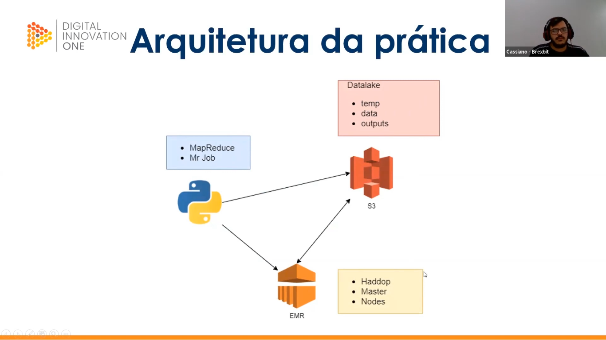

    
<h1>Criando seu Ecossistema de Big Data na Nuvem </h1>

>C om base no repositório disponibilizado pelo expert, te desafiamos a replicar e, porque não, melhorar o algoritmo de extração/contabilização de palavras. Para isso, você pode ordenar as palavras por ocorrência e não por ordem alfabética (apresentando as mais citadas no texto com prioridade), por exemplo. Sinta-se à vontade para evoluir o algoritmo de outras formas.
* Carga horária: 2 h
* Nível: Intermediário

# Desafio

* Instruções: <a href="https://github.com/cassianobrexbit/DIO-LiveCoding-AWS-BigData">DIO-LiveCoding-AWS-BigData</a>
* Arquitetura:

* Resultados:
    * <a href="https://github.com/jclizar/bootcamp_Cognizant_CloudDataEngineer/tree/main/atividades/25_Criando_seu_Ecossistema_de_Big_Data_na_Nuvem/data/">data</a>
    * <a href="https://github.com/jclizar/bootcamp_Cognizant_CloudDataEngineer/tree/main/atividades/25_Criando_seu_Ecossistema_de_Big_Data_na_Nuvem/output/logs1/">output</a>
